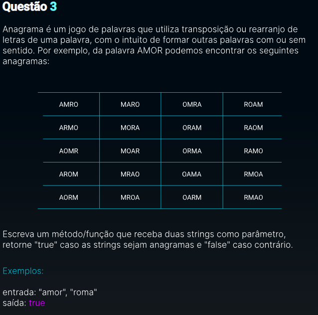

# Teste_Vaga_Estagio
Teste estágio desenvolvimento

## Questão 1
  
 
## Questão 2
  Crie uma escada formada por '#' de altura n. O último nível deve ter tamanho n, e o primeiro, tamanho n.__
  Exemplo:__
  

## Questão 3
  
